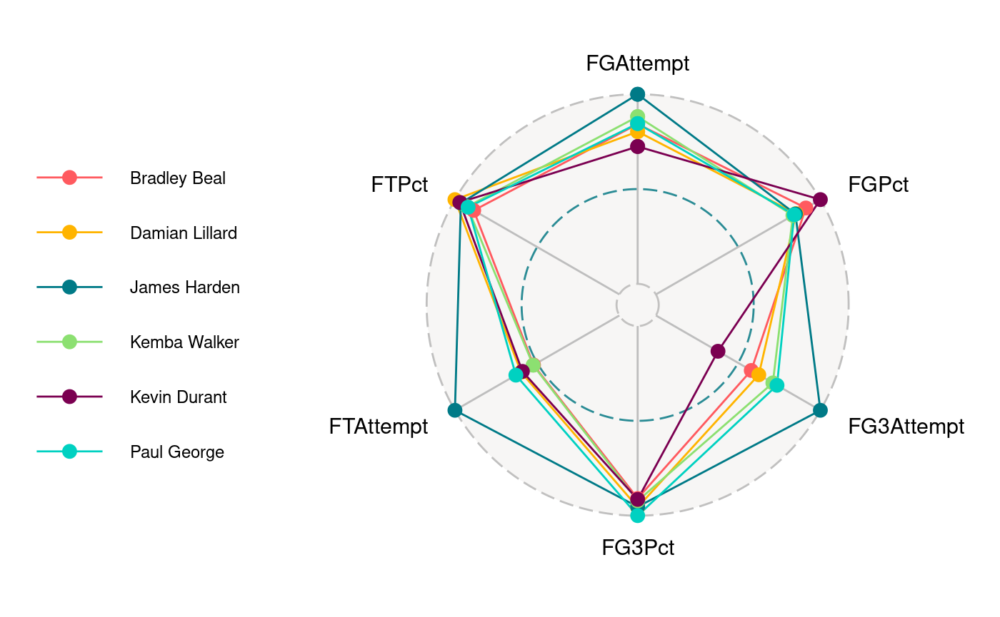

<style>
  h1 {
     font-family: Optima, sans-serif;
     font-size: 40px;
}
  p {
    font-family: Arial, sans-serif;
    font-size: 20px;
  }
  d-article {
    grid-template-columns: none;
    margin: 0 30px 0 30px;
  }
  h2 {
     font-size: 30px;
  }
}
</style>

```{r setup, include=FALSE}
knitr::opts_chunk$set(echo = FALSE)
```

<h1>Below are some of the graphic visualizations created using generative art programs</h1>

<div style='display:flex;flex-direction:row;'>

<div style='display:flex;flex-direction:column;align-items:center;padding:10px'>
<h1 style='margin:8px;color: #0257d8;'> University </h1>
```{r}

```
</div>

<div style='display:flex;flex-direction:column;align-items:center;padding:10px'>
<h1 style='margin:8px;color: #067008;'> Green Fog </h1>
```{r}

```
</div>

<div style='display:flex;flex-direction:column;align-items:center;padding:10px'>
<h1 style='margin:8px;color: #871c1c;'> Lava </h1>
```{r}

```
</div>

</div>

<h1> Other Course Visualizations </h1>

<h2> Breakdown of Top NBA Scorers in 2019 </h2>
<div style='display:flex;flex-direction:row'>
```{r}

```
<p style='width:60%;'>This radar chart used player data from the 2018-2019 NBA season which encompassed a variety of statistics including the percentages used in my graph above as well as raw totals such as points, rebounds, assists, etc. I sorted the data down to the top six scorers of the season and charted each player against each other comparing their volume and percentages for all field goal attempts, free throw attempts, and three points attempts in the season. The variables were scaled to be percentages of the max value in order to fit the chart. The visualization demonstrates that James Harden had substantially greater volume of attempts for all shots described, particularly at the free throw line. It raises the question as to if his scoring dominance in the season was aided by sheer volume of shot attempts considering his efficiency was middle of the pack for each shot attempt.</p>
</div>

<h2> First Generation College Students and Outliers </h2>
<div style='display:flex;flex-direction:row-reverse'>
```{r}
library(Lock5Data)
data("CollegeScores4yr")

CollegeData = CollegeScores4yr[complete.cases(CollegeScores4yr) == TRUE, ]
attach(CollegeData)
rm(CollegeScores4yr)
outlier_vals = function(vec){
  low.val = mean(vec) - 2*sd(vec)
  high.val = mean(vec) + 2*sd(vec)
  output = c(low.val,high.val)
  names(output) = c("low.val", "high.val")
  return(output)
}
```


```{r}
library(ggplot2)
firstgen.out = NULL
out.vals = outlier_vals(FirstGen)
for (i in 1:length(FirstGen)) {
  if (FirstGen[i] < out.vals["low.val"]) {
    firstgen.out[i] = "low"
  }else if (FirstGen[i] > out.vals["high.val"]) {
    firstgen.out[i] = "high"
  }else{
    firstgen.out[i] = "aok"
  }
}

ggplot() +
  geom_dotplot(aes(x = FirstGen, fill = firstgen.out), binwidth = .6) +
  geom_vline(xintercept = out.vals["low.val"]) +
  geom_vline(xintercept = out.vals["high.val"]) +
  labs(x = "Percent of First Generation College Students", title = "First Generation College Students and Outlier Proportions") +
  guides(fill=guide_legend(title="Outlier?"))
  
```

<p style='width:60%;'> This dot plot was constructed with data from the Lock5Data set built into RStudio titled CollegeScores4yr. The data provides a variety of information about 4 year colleges and universities, and I used it to summarize the distribution of first generation college students, while identifying high and low outliers through color variation and vertical lines at each boundary. The average percentage comes to around 30 percent but the graph demonstrates significant variation based on the university. Certain colleges accept 60% of their class as first generation college students while a significant portion accept below 10%. Further analysis could be done to understand what variables are most associated with high and low acceptance rates of first generation students. </p>
</div>


<h2> Intelligence = Interests? </h2>
<div style='display:flex;flex-direction:row'>

```{r}
library(ggplot2)

ggplot(StudentSurvey, aes(x = Award, y = GPA, fill = Award)) +
  geom_violin(scale = "width", alpha = 0.5) +
  guides(fill = "none") +
  geom_dotplot(binaxis = "y", binwidth = 0.1, stackdir = "center", dotsize = .25)
```

<p style='width:60%;'> StudentSurvey is a data set provided through RStudio that polled 362 students on a variety of questions, some seeming more pertinent than others. One of the more abstract questions pertained to which award was preferred by students. The relationship between the answers to that questions and students GPAs is depicted with a violin chart and dotplots which help to describe the frequency and distribution of the observations for each variable. It's obvious that academy awards were least popular, and this smaller sample size may contribute to the larger variation in its relationship with GPAs. The more popular selections of the Nobel and Olympic achievements show aspiring Nobel winners to have a greater density of high GPAs, yet those preferring Olympic medals occupy the only three 4.0s measured. While other variables are certainly in play, it's interesting to note the high end academic achievement of the aspiring athletes. </p>
</div>

<h2> Interactive Visualization Link </h2>

```{r}

```

<p> Above is a static image of a Shiny app created by myself and a classmate that was designed with the intention of helping intro stat students understand confidence intervals. The corresponding link to the interactive application can be found below. The app helps guide repeated sampling, building a sampling distribution, and evaluating the confidence intervals given the user input so one can see the changes in width and accuracy as variabls such as sample size and confidence level change. </p>

<a href="https://rconnect.bucknell.edu/content/f39d076b-583b-4999-ac88-2b9ebf262264">Confidence Level App</a>
